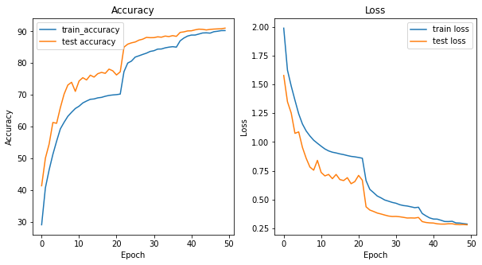

The model reaches a maximum Test accuracy of 91.01% and Train Accurary of 90.242 on CIFAR-10 dataset using ResNet-18 model.

LR Finder and Reduce LR on Plateau was implemented for model training.

Epochs: 50

Data Augmentation

The following data augmentation techniques were applied to the dataset during training:

  Horizontal Flip,
  Rotation,
  CutOut,

GradCAM
Some of the examples of GradCAM on misclassified images is shown below:

Change in Training and Validation Accuracy

Group Members
A.Naga Kalyani 
B.Kavya Shruthi
